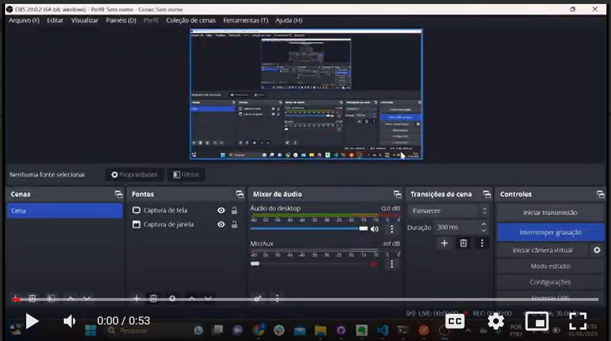

### Visão Computacional
<br>
O objetivo dessa atividade é utilizar o YOLOv8 para aplicar um filtro em um dataset específico, no caso, um conjunto de imagens contendo bolas de basquete, e encontrar a bola de basquete em algum local da imagem.

O YOLOv8, que significa "You Only Look Once version 8", é uma arquitetura de rede neural convolucional usada para detecção de objetos em imagens. É uma evolução do modelo original YOLO (You Only Look Once), desenvolvido para melhorar a precisão e o desempenho da detecção em tempo real.

Essa abordagem utiliza redes neurais profundas para detectar objetos em uma imagem. Ela divide a imagem em uma grade de células e, em cada célula, prevê a probabilidade de existir um objeto e as coordenadas do seu bounding box (caixa delimitadora). Além disso, o YOLOv8 também classifica o objeto detectado em uma ou mais categorias pré-definidas.

A visão computacional é uma área da inteligência artificial que permite que os computadores "vejam" e compreendam imagens e vídeos. Ela utiliza algoritmos e técnicas para processar, analisar e extrair informações úteis a partir de dados visuais.

A visão computacional possui diversas aplicações em diferentes setores. Por exemplo, é possível treinar algoritmos para detectar e reconhecer objetos em imagens ou vídeos, como rostos, veículos e objetos específicos em linhas de produção. Também é possível classificar automaticamente imagens em categorias pré-definidas, como reconhecimento de animais, identificação de doenças em imagens médicas e classificação de produtos em sistemas de e-commerce.

Além disso, a visão computacional permite rastrear a trajetória de objetos em movimento em vídeos, sendo útil para o acompanhamento de veículos em sistemas de segurança ou a identificação de movimentos suspeitos. Também é utilizada em aplicações de realidade aumentada, onde objetos virtuais são sobrepostos ao mundo real, possibilitando experiências imersivas em jogos, aplicativos de compras virtuais e design de interiores.

Na indústria, a visão computacional é amplamente aplicada em sistemas de inspeção automatizada, onde câmeras são utilizadas para identificar defeitos em produtos, realizar controles de qualidade e monitorar processos de fabricação. Além disso, é utilizada na navegação de robôs, permitindo que eles entendam seu ambiente com base em informações visuais e tomem decisões autônomas em ambientes complexos, como robôs autônomos em hospitais e sistemas de entrega automatizados.

Esses são apenas alguns exemplos das diversas aplicações da visão computacional, que oferece um amplo leque de possibilidades para melhorar processos, auxiliar em diagnósticos, criar experiências interativas e impulsionar a automação em várias indústrias.
<br>

### Explicação do código
1 - Importação das bibliotecas:
```
import os
from ultralytics import YOLO
from IPython.display import display, Image
```
O código está importando as bibliotecas necessárias para o funcionamento do script. A biblioteca os é utilizada para lidar com funções relacionadas ao sistema operacional, enquanto a ultralytics é uma biblioteca que fornece uma interface para o YOLO (You Only Look Once) e a IPython.display é usada para exibir imagens no notebook.

<br>
2 - Definição da variável HOME:

```
HOME = os.getcwd()
print(HOME)
```

A variável HOME armazena o diretório de trabalho atual (current working directory), ou seja, o diretório onde o script Python está sendo executado. O comando os.getcwd() retorna esse diretório e a variável HOME armazena seu valor. O comando print(HOME) imprime o valor do diretório de trabalho atual.
<br>
<br>

3 - Instalação da biblioteca ultralytics:
``` 
!pip install ultralytics
```
Esse comando instala a biblioteca ultralytics através do gerenciador de pacotes pip.
<br>
<br>
4 - Criação da pasta de datasets:
``` 
!mkdir {HOME}/datasets
```
Esse comando cria uma nova pasta chamada "datasets" no diretório de trabalho atual.
<br>
<br>
5 - Acesso à pasta datasets:
``` 
%cd {HOME}/datasets
```
Esse comando muda o diretório de trabalho atual para a pasta "datasets".
<br>
<br>
6 - Instalação da biblioteca roboflow:
``` 
!pip install roboflow --quiet
```
Esse comando instala a biblioteca roboflow através do pip.

<br>
<br>
7 - Importação da classe Roboflow e definição de chaves e propriedades de comunicação:

``` 
from roboflow import Roboflow

rf = Roboflow(api_key="KgCmrTy3yVBRdn2slbDT")
project = rf.workspace("aidatasets-qwszk").project("datasets-iztee")
dataset = project.version(4).download("yolov8")
```
Essas linhas importam a classe Roboflow da biblioteca roboflow e definem as chaves e propriedades de comunicação com o Roboflow. É criada uma instância da classe Roboflow com a chave de API fornecida. Em seguida, é definida a área de trabalho ("aidatasets-qwszk") e o projeto ("datasets-iztee") que contém o dataset desejado. A versão 4 do projeto é baixada e armazenada na variável dataset.

8 - Retorno ao diretório de trabalho anterior:
``` 
%cd {HOME}
```
Esse comando retorna ao diretório de trabalho anterior, ou seja, o diretório principal.
<br>
<br>
9 - Treinamento do modelo YOLOv8:
```
!yolo task=detect mode=train model=yolov8s.pt data={dataset.location}/data.yaml epochs=10 imgsz=800 plots=True
```
Esse comando executa o treinamento do modelo YOLOv8 utilizando o dataset baixado anteriormente. São especificados parâmetros como a tarefa ("detect"), o modo de treinamento ("train"), o modelo a ser utilizado ("yolov8s.pt"), o arquivo de configuração dos dados
<br>
<br>

### Vídeo de demonstração
<br>

[](https://drive.google.com/drive/folders/16-ATSRvOWf-3vETDVWzTqErSbsHVBEXY)